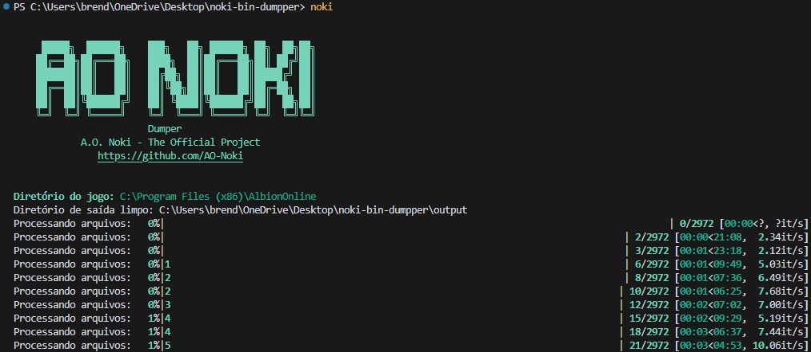

[](./README.md)

# A.O. Noki - Bin Dumper

### Description
A.O. Noki is a cross-platform data extractor for **Albion Online**. This tool extracts and converts binary data from the game client into readable formats (RAW and JSON), maintaining detailed process logs.

### Features
- Automatic game client detection
- Binary file decryption
- Multiple export formats (RAW and JSON)
- Live and Test server support
- Advanced logging system with file rotation
- Automatic data validation
- Detailed validation reports
- Cross-platform compatibility
- Real-time progress bar interface

### Technical Details

#### Encryption
- Algorithm: Triple DES (3DES)
- Mode: CBC (Cipher Block Chaining)
- Key Size: 128 bits
- IV: 8 bytes
- Padding: PKCS7

#### Compression
- Algorithm: ZLIB
- Window Bits: 31 (15 + 16 for gzip format)
- Output Format: XML with UTF-8 + BOM encoding

#### Logging System
- Automatic file rotation (max 5MB per file)
- Separate logs for validation and general operations
- JSON and TXT reports for detailed analysis
- Automatic file categorization

### Compatibility
- Windows 7/8/10/11
- Linux (all major distributions)
- macOS 10.15+
- Python 3.12+

### Installation

#### Via Executable (Recommended)
1. Download the latest version from the [releases page](../../releases)
2. Extract the file (if necessary)
3. Run the program:
   - Windows: `noki.exe`
   - Linux/macOS: `./noki` or `python -m noki`

#### Via Source Code
1. Ensure Python 3.12+ is installed
2. Clone the repository:
   ```bash
   git clone https://github.com/AO-Noki/noki-bin-dumpper.git
   cd noki-bin-dumpper
   ```
3. Install the package:
   ```bash
   # Basic installation
   pip install .
   
   # Or with development dependencies
   pip install -e ".[dev]"
   ```

### Usage

#### Command Line Arguments

```bash
noki [-h] [-t {1,2,3}] [-s {1,2}] [-g GAME_PATH] [-o OUTPUT_PATH]
```

##### Optional Arguments:
- `-h, --help`: Show help message
- `-t, --export-type`: Export format
  - `1`: RAW only
  - `2`: Filtered JSON only
  - `3`: Both (default)
- `-s, --server`: Server type
  - `1`: Live Server (default)
  - `2`: Test Server
- `-g, --game-path`: Game installation path (automatically detected if not provided)
- `-o, --output-path`: Output directory (uses './output' if not provided)

#### Examples

```bash
# Basic usage (automatically detects game path)
noki
```

#### Specify game path and output directory

```bash
noki -g "C:\Program Files (x86)\Albion Online" -o "C:\albion_data"
```

#### Export JSON data from test server only

```bash
noki -t 2 -s 2
```

### Log Structure
- `logs/`: Main log directory
  - `noki-dumper_YYYYMMDD_HHMMSS.log`: Main operations log
  - `validation/`: Validation logs
    - `validation_YYYYMMDD_HHMMSS.log`: Detailed validation log
    - `validation_report_YYYYMMDD_HHMMSS.json`: JSON format report
    - `validation_summary_YYYYMMDD_HHMMSS.txt`: Text format summary

### Decryption Process
1. Binary file reading
2. Decryption using 3DES in CBC mode
3. PKCS7 padding removal
4. ZLIB decompression (wbits=31)
5. UTF-8 decoding with BOM removal
6. XML validation
7. JSON conversion (when applicable)
8. Conversion validation

### Contact
Discord: **n0k0606**