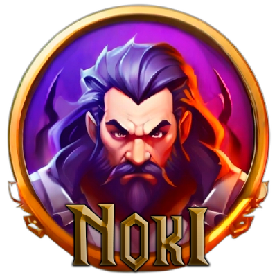

# AO NOKI - Bin Dumpper

<p align="center">
  
</p>

<p align="center">
  <strong>Albion Online .bin file extractor and converter</strong>
</p>

<p align="center">
  <a href="https://github.com/AO-Noki/noki-bin-dumpper/actions/workflows/release.yml">
    
  </a>
  <a href="https://github.com/AO-Noki/noki-bin-dumpper/actions/workflows/test_and_release.yml">
    
  </a>
  <a href="https://github.com/AO-Noki/noki-bin-dumpper/actions/workflows/code_quality.yml">
    
  </a>
</p>

## 📋 Description

**NOKI Bin Dumpper** is a tool for extracting and converting encrypted .bin files from Albion Online. It decodes binary files to XML and JSON formats, allowing access to and study of the game's information.

<p align="center">
  
</p>

## ✨ Features

- **Automatic detection** of Albion Online installation
- **Multi-platform support**: Windows, macOS, and Linux
- **Smart extraction** of game .bin files
- **Conversion** to XML and JSON
- **Intuitive command-line interface**
- **Support for Live and Test servers**
- **CI/CD integration** for automatic releases

## 🧪 Test Results

```
============================================= tests coverage ==============================================
Name                        Stmts   Miss  Cover
src\__init__.py                 6      0   100%
src\core\Config.py             93     42    55%
src\core\Platform.py          110     62    44%
src\core\__init__.py            3      0   100%
src\enums\__init__.py           2      0   100%
src\enums\server_type.py        7      1    86%
src\platforms\__init__.py       2      0   100%
src\platforms\base.py          45     32    29%
src\utils\Converter.py         23      3    87%
src\utils\Crypto.py            19      1    95%
src\utils\__init__.py           3      0   100%
-----------------------------------------------
TOTAL                         313    141    55%
=========================================== 10 passed in 3.18s ============================================
```

## 🚀 Installation

### Via pip (recommended)

```bash
pip install noki-bin-dumpper
```

### Pre-compiled executable

Download the latest version for your operating system from [Releases](https://github.com/AO-Noki/noki-bin-dumpper/releases).

### Install from source code

```bash
git clone https://github.com/AO-Noki/noki-bin-dumpper.git
cd noki-bin-dumpper
pip install -e .
```

## 🔧 Requirements

- Python 3.10+ (Python 3.13 recommended)
- Albion Online installed (for direct extraction)

## 📖 Usage

### Executable

```bash
noki --path "C:\Program Files (x86)\Albion Online" --server live --output "./output"
```

### Via Python

```bash
python -m main --path "C:\Program Files (x86)\Albion Online" --server live --output "./output"
```

### Options

```
--path PATH           Albion Online installation path (required)
--server [live|test]  Game server to export the files from (default: live)
--output PATH         Output directory (optional, defaults to ./output)
--help                Show help message and exit
```

## 🏗️ Build

To build the executable:

```bash
python build.py
```

Options:

```
--dir                 Build as directory instead of single file
--no-console          Hide console (for GUI applications only)
--no-zip              Don't create ZIP package
--info                Show build information and exit
```

## 🔄 Development Workflow

1. Automated tests verify basic functionality
2. Code quality analysis ensures consistent standards
3. CI/CD compiles and tests on multiple platforms and Python versions
4. Releases are automatically published when a v*.*.* tag is created

## 📜 License

This project is distributed as Freeware.

## 👥 Contributors

- Brendown Ferreira - Lead Developer
- AO-Noki Community Contributors

## 📧 Contact

- GitHub: [https://github.com/AO-Noki](https://github.com/AO-Noki)
- Email: br3n0k@gmail.com

## 🔗 Links

- [Albion Online](https://albiononline.com/)
- [GitHub Repository](https://github.com/AO-Noki/noki-bin-dumpper)
- [Changelog](CHANGELOG.md)
